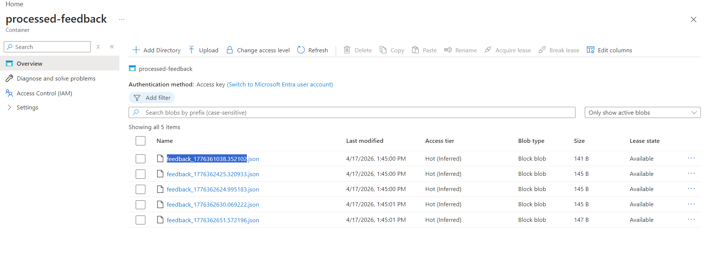

# Feedback Data Pipeline (Azure + Python)

## 🚀 Overview
A data pipeline that processes user feedback from Azure Blob Storage, transforms it, and stores processed output for analytics.

---

## ⚙️ Architecture
1. Raw JSON files stored in Azure Blob Storage
2. Python script reads and processes data
3. Metadata added (e.g., feedback length)
4. Processed data stored back in Azure

---

## 🛠️ Tech Stack
- Python
- Azure Blob Storage
- JSON Processing

---

## 📸 Screenshots

### Azure Blob Storage (Raw Data)


### Processed Output


---

## ▶️ How to Run
```bash
pip install -r requirements.txt
python pipeline.py
